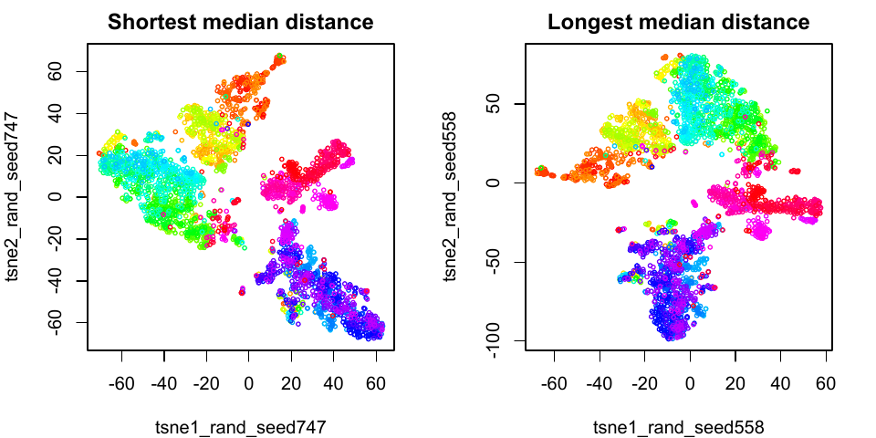
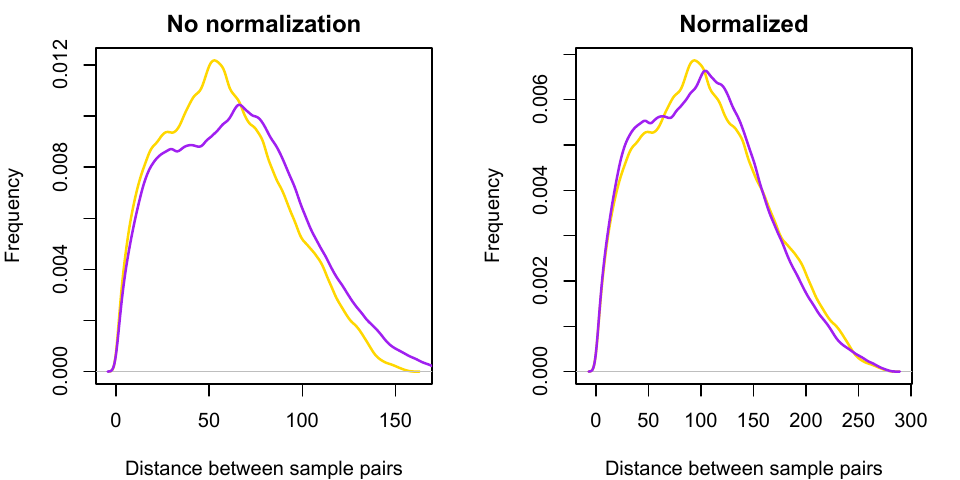
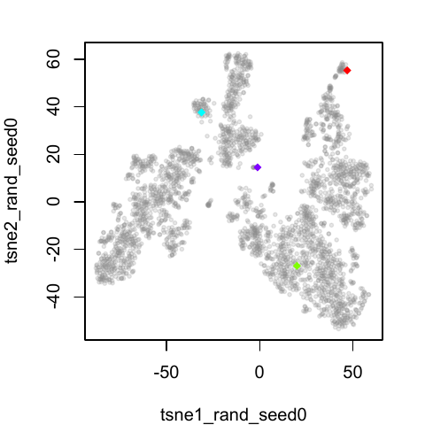
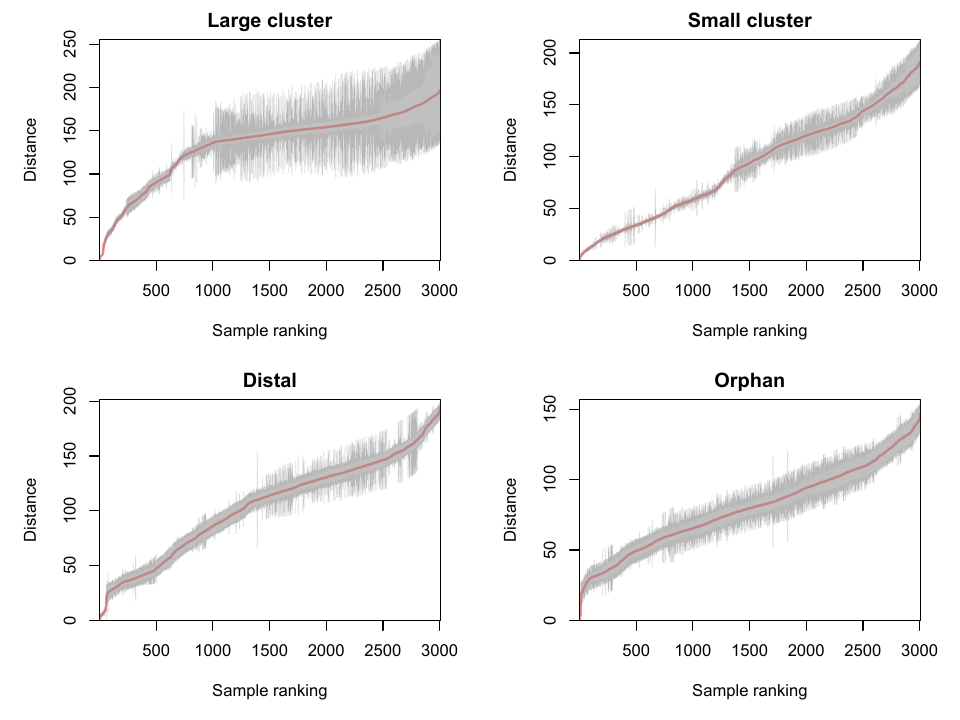
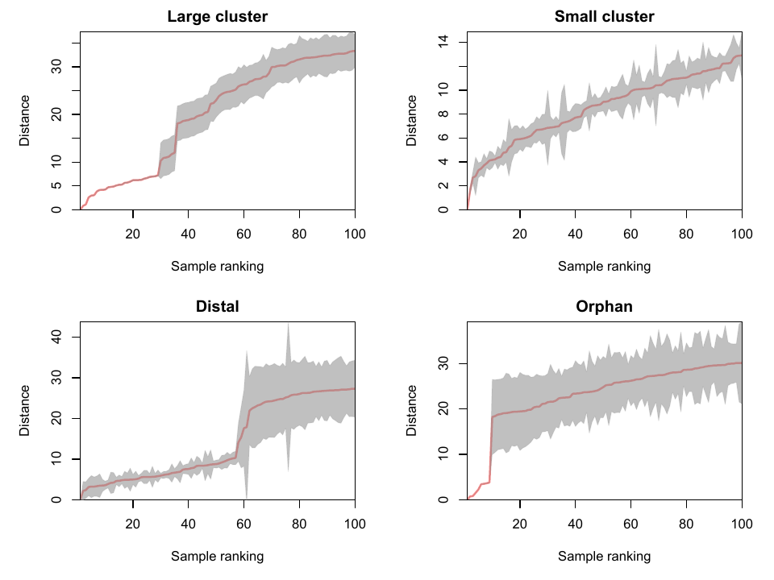

# tSNEd
 
Consensus of multiple t-SNE runs

## Introduction

The t-SNE algorithm is known for its inconsistent output between runs using the same input and parameters. This inconsistency makes it difficult to intepret the overall structure of sample clustering on a t-SNE apace. 

The goal of this project is to test the possibility of drawing consensus of sample clustering from multiple t-SNE runs, and render the results in a more conventional way, such as hierarchical clustering.

This project uses a single cell RNA-seq data set published by Zeisel et. al. in 2015, which includes about 3000 single cell samples. The same data was used for 1000 t-SNE runs, using the same parameters and random seeds. Each run generated a 2-column matrix of the coordinates of all samples on a 2-dimensional t-SNE space. 

## Conclusion

Although the t-SNE runs have different layouts, the distance between sample pairs on t-SNE space is mostly consistent across runs. A consensus of sample-sample distance can be obtained from multiple runs, and the consensus can be used to render results in a more converntional way, such as hierarchical clustering.

## Results

### Normalization

To perform a consensus, we need to make sure that the distance between all sample pairs on a t-SNE space has the distribution between runs. 

**Figure 1.** the distribution of median sample-sample distance of 1,000 runs. It suggests that normalization is necessary.

**Figure 2.** 2 t-SNE runs with the largest and smallest median sample-sample distance. While they have different structure and orientation, the patterns of sample clustering are similar.

**Figure 3.** The distribution of all sample-sample distance of the 2 runs in the last figure. A simple rescaling will get rid of the most of the difference. The rescaling set the median distance of all runs to 100.

### Consistency

After sample-sample distance is normalized, we can compare it between multiple runs. To simplify analysis, we calculate the distance of selected individual samples to all the other samples across runs. 

**Figure 4.** 4 randomly selected samples of specific types:

 - **green:** member of a large cluster
 - **blue:** member of a small, compact cluster
 - **red:** sample located on the edge of the t-SNE space
 - **purple:** orphan sample doesn't belong to any clusters
 

**Figure 5.** Mean (solid line) and standard deviation (grey area) of the distance between the 4 selected samples and all other samples. The samples ranked by their mean distance to the selected sample across 1000 runs. 

**Figure 6.** Zoom-in of the previous figure to the top 100 nearest samples of the selected sample.

### Consensus

