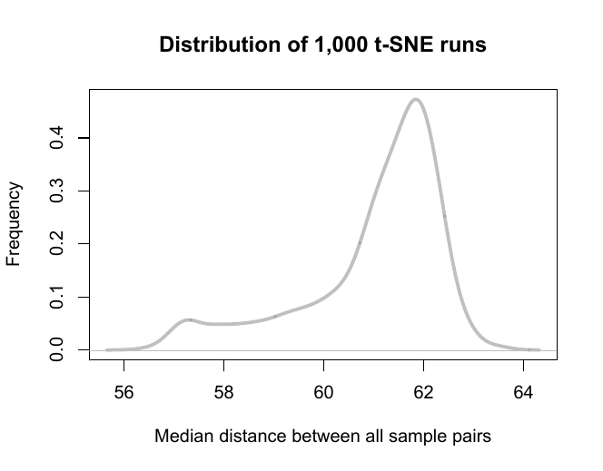

# tSNEd
 
Consensus of multiple t-SNE runs

## Introduction

The t-SNE algorithm is known for its inconsistent output between runs using the same input and parameters. This inconsistency makes it difficult to intepret the overall structure of sample clustering on a t-SNE apace. 

The goal of this project is to test the possibility of drawing consensus of sample clustering from multiple t-SNE runs, and render the results in a more conventional way, such as hierarchical clustering.

This project uses a single cell RNA-seq data set published by Zeisel et. al. in 2015, which includes about 3000 single cell samples. The same data was used for 1000 t-SNE runs, using the same parameters and random seeds. Each run generated a 2-column matrix of the coordinates of all samples on a 2-dimensional t-SNE space. 

## Conclusion

Although the t-SNE runs have different layouts, the distance between sample pairs on t-SNE space is mostly consistent across runs. A consensus of sample-sample distance can be obtained from multiple runs, and the consensus can be used to render results in a more converntional way, such as hierarchical clustering.

## Results

### Normalization

To perform a consensus, we need to make sure that the distance between all sample pairs on a t-SNE space has the distribution between runs. 

The figure below shows the distribution of median sample-sample distance of 1,000 runs:

